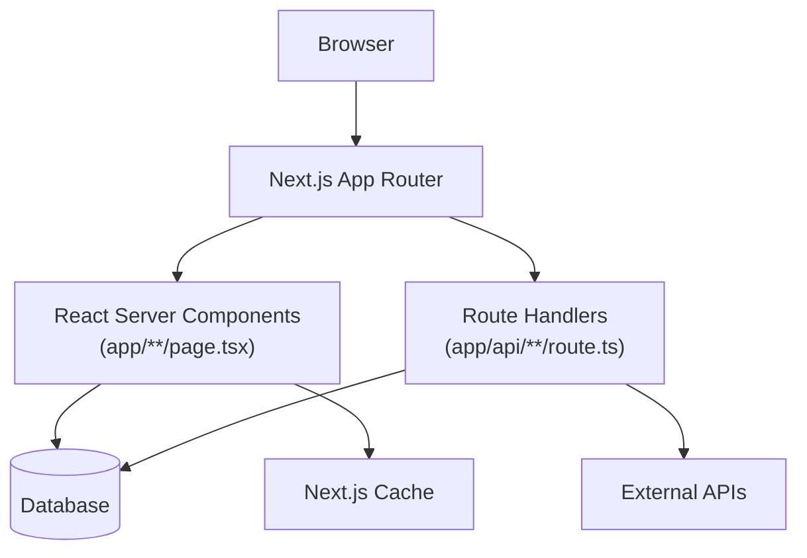
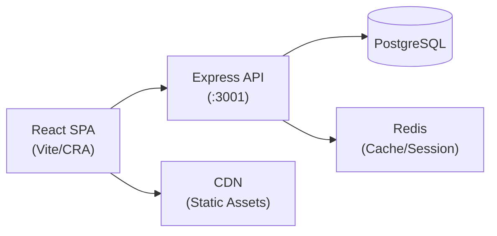
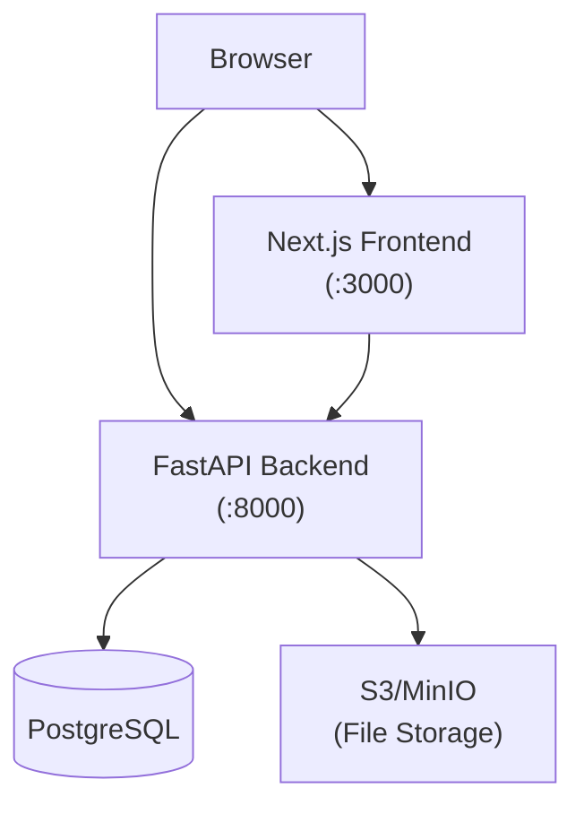
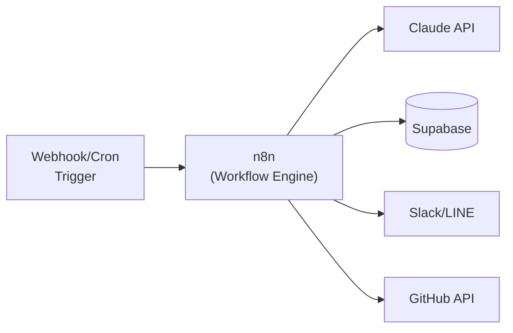
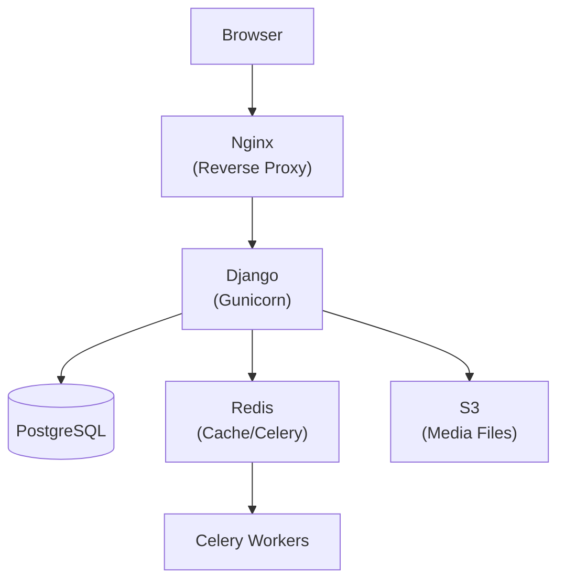
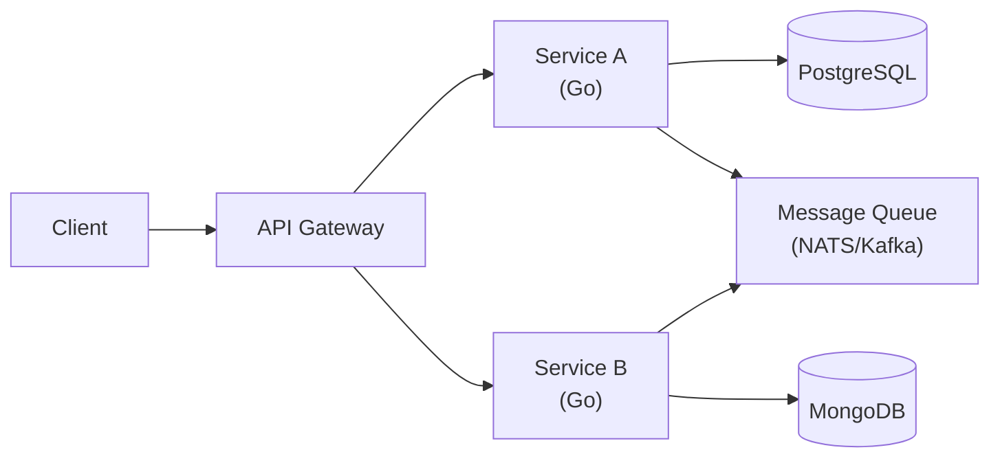

# Architecture Pattern Detection Guide

## フレームワーク別アーキテクチャ図テンプレート

### Next.js App Router

### Express + React SPA

### FastAPI + Next.js

### n8n Automation Workflow

### Django + PostgreSQL

### Go Microservices

---

## ディレクトリ命名規則の解釈

| ディレクトリ | 一般的な役割 |
|---|---|
| `src/` `app/` `lib/` | ソースコードのルート |
| `api/` `routes/` `endpoints/` | APIエンドポイント定義 |
| `components/` `ui/` | UIコンポーネント |
| `services/` `domain/` | ビジネスロジック |
| `models/` `entities/` `schemas/` | データモデル定義 |
| `utils/` `helpers/` `shared/` | ユーティリティ関数 |
| `hooks/` | React Hooks |
| `tests/` `__tests__/` `spec/` | テストファイル |
| `prisma/` `migrations/` | DBスキーマ・マイグレーション |
| `public/` `static/` `assets/` | 静的ファイル |
| `scripts/` `tools/` `bin/` | 開発・運用スクリプト |
| `docs/` `.github/` | ドキュメント・GitHub設定 |

---

## エントリポイント検出ロジック

以下の順で確認し、最初に見つかったものがエントリポイント：

### Node.js/TypeScript
1. `package.json` の "main" フィールド
2. `src/index.ts` / `src/index.js`
3. `app/page.tsx` (Next.js App Router)
4. `pages/index.tsx` (Next.js Pages Router)
5. `src/App.tsx` (React SPA)
6. `server.ts` / `server.js`

### Python
1. `pyproject.toml` の `[tool.poetry.scripts]`
2. `main.py`
3. `app.py` / `application.py`
4. `src/main.py`
5. `manage.py` (Django)
6. `wsgi.py` / `asgi.py`

### Go
1. `cmd/main.go`
2. `main.go`

### Rust
1. `src/main.rs`

### 汎用フォールバック
1. `Dockerfile` の ENTRYPOINT / CMD
2. `Makefile` の `run` ターゲット

---

## 「どこを読めばいい?」クイックリファレンス（フレームワーク別）

### Next.js App Router
| やりたいこと | 場所 |
|---|---|
| 新ページ追加 | `app/<route>/page.tsx` |
| API エンドポイント追加 | `app/api/<endpoint>/route.ts` |
| DB スキーマ変更 | `prisma/schema.prisma` + migration |
| 環境変数追加 | `.env.local` + `next.config.js` |

### Express + React
| やりたいこと | 場所 |
|---|---|
| 新 API ルート | `server/routes/` |
| フロント UI 追加 | `client/src/components/` |
| DB 変更 | `server/models/` + migration file |
